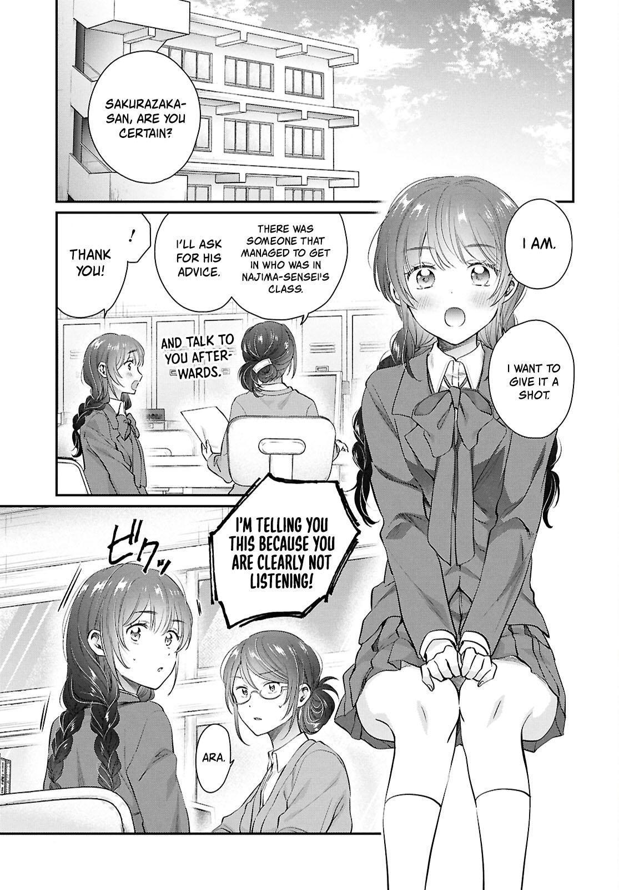
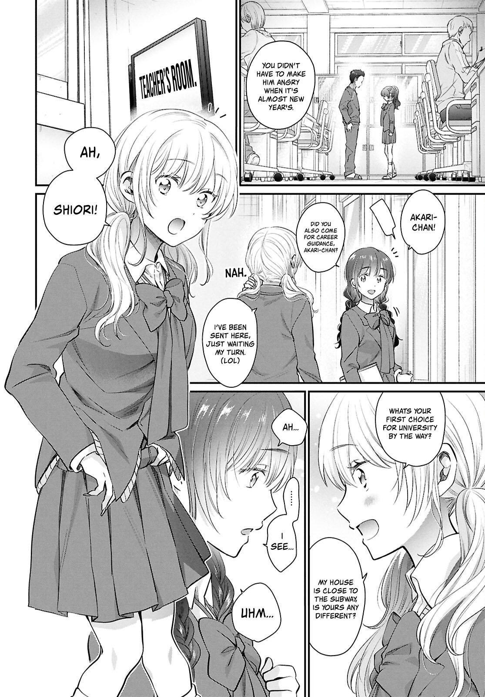
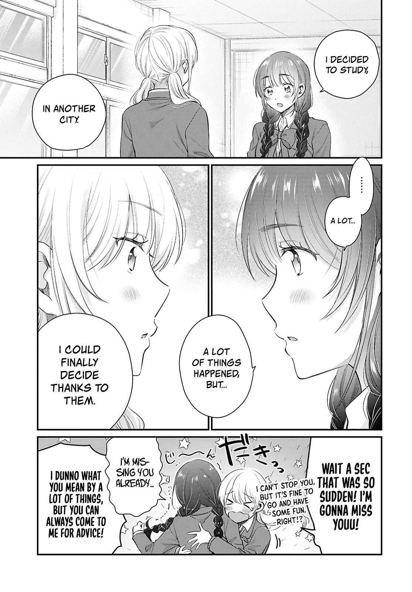
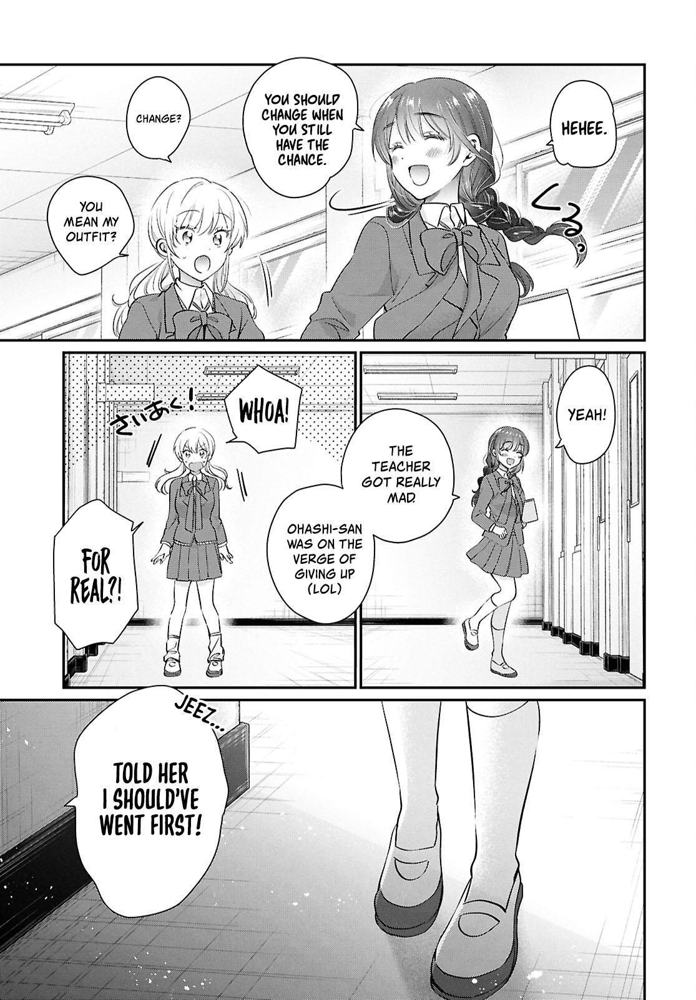
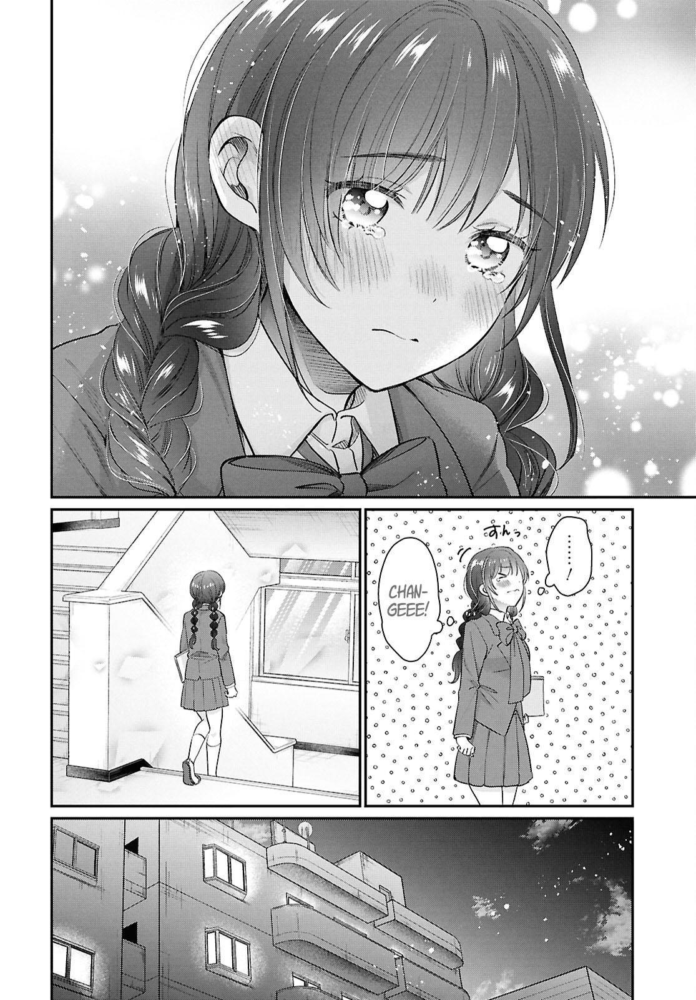
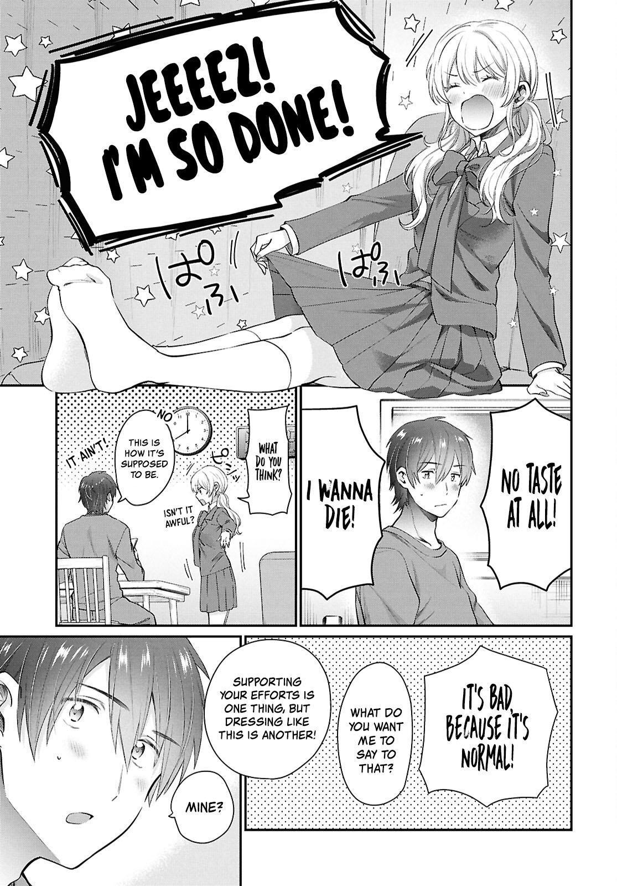
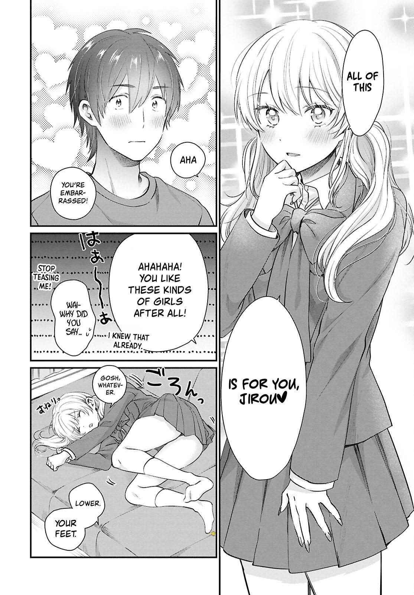
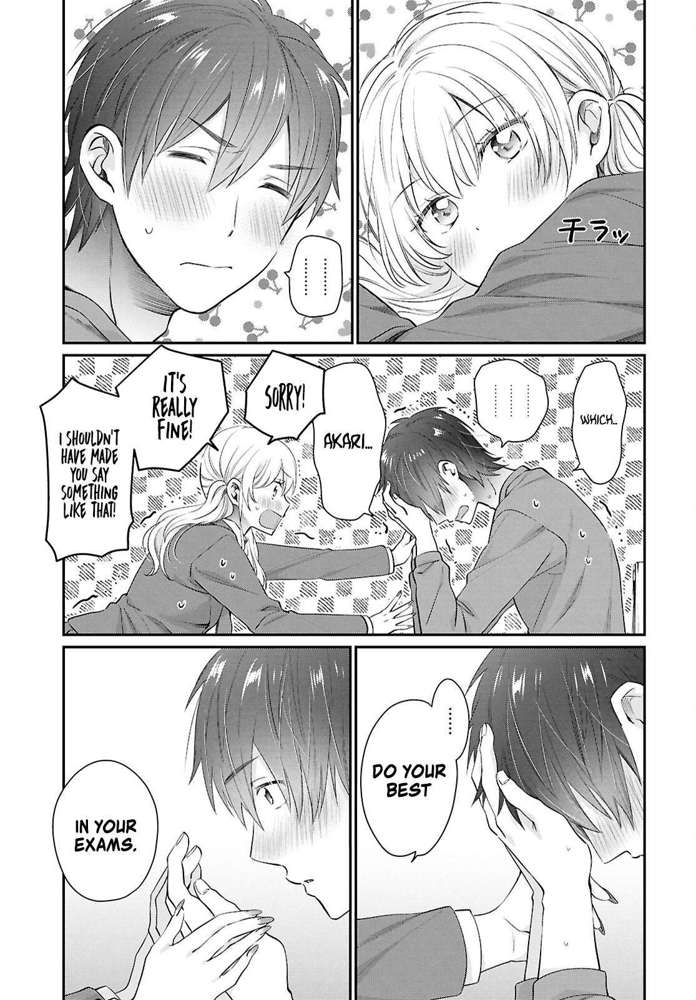
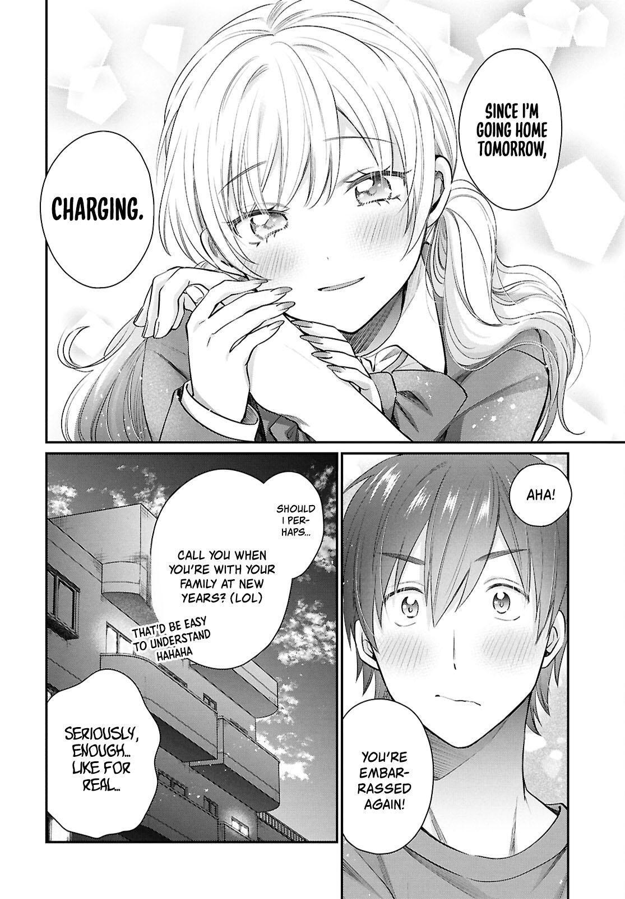
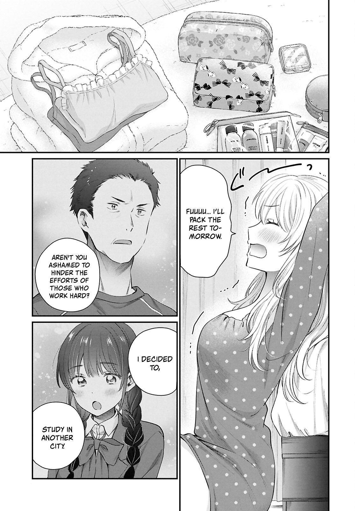

## Fufu ijou Koibito miman / [FuuKoi](https://fuukoi-anime.com/)

Jirou adalah otaku yang mencintai teman saat kecilnya sakurazaka shiori, mereka merupakan pasangan yang berbeda dalam praktik menjadi keluarga disekolahnya, akari, seorang gal yang menyukai tenjin minami secara kebetulan merupakan pasangan praktik shiori, akari yang masih menyukai minami dengan keterbukaannya dan jirou serta shiori yang penuh kesalah pahaman dalam pernyataan cintanya, mereka berlomba mengincar pringkat untuk melakukan pertukaran pasangan, untuk mencapai hal itu mereka harus bermesraan dengan pasangan praktik nya, akankah keinginan mereka menjadi nyata ?... `This page writer`

| **Informasi**      | **Detail**                     |
|--------------------|--------------------------------|
| **Pengarang**      | Yūki Kanamaru                  |
| **Penerbit**       | Kadokawa Shoten                |
| **Imprint**        | Kadokawa Comics A              |
| **Majalah**        | Young Ace                      |
| **Demografi**      | Seinen                         |
| **Terbit**         | 02 Maret 2018 – sekarang       |
| **Volume**         | 11[(Daftar volume)](#daftar-volume)              |
| status             | `ongoing` |

### new chapt 72

### Daftar Volume

| No. | Tanggal Rilis     | ISBN                     |
|-----|-------------------|--------------------------|
| 1   | 26 Oktober 2018   | ISBN 978-4-04-107484-8 |
| 2   | 26 Maret 2019     | ISBN 978-4-04-108019-1 |
| 3   | 26 September 2019 | ISBN 978-4-04-108590-5 |
| 4   | 03 April 2020     | ISBN 978-4-04-109101-2 |
| 5   | 04 November 2020  | ISBN 978-4-04-110704-1 |
| 6   | 04 Juni 2021      | ISBN 978-4-04-111364-6 |
| 7   | 03 Desember 2021  | ISBN 978-4-04-112113-9 |
| 8   | 02 Mei 2022       | ISBN 978-4-04-112483-3 |
| 9   | 04 Oktober 2022   | ISBN 978-4-04-112962-5 |